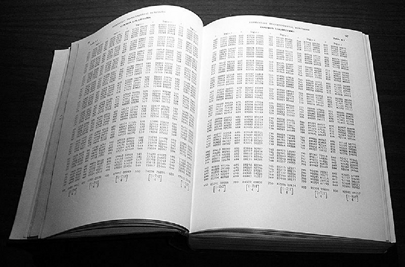
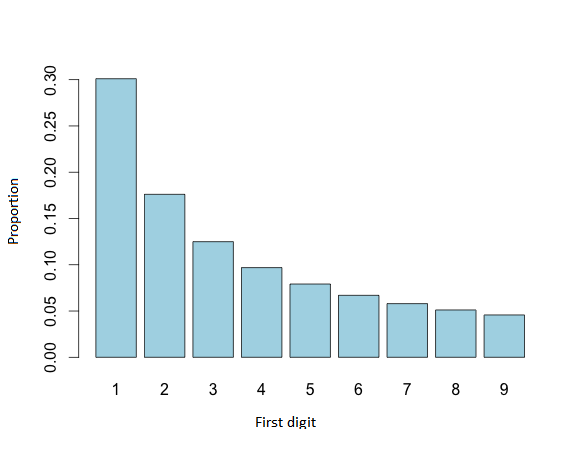

## Instalation

The package is available on CRAN and you can install by running:

```{r, eval=FALSE}
install.packages("benford.analysis")
```

To install the development version from GitHub, you need to install the `devtools` package. This package is hosted on CRAN and you can be install by running `install.packages("devtools")`.

```{r, eval=FALSE}
devtools::install_github("carloscinelli/benford.analysis", build_vignettes = TRUE)
```

This document gives a tour of `benford.analysis` (version 0.1.5) functionalities. See `help("benford.analysis")` for further details and references provided by `citation("benford.analysis")`.

Load the `benford.analysis` package and the data `taxable.incomes.1978` running the following commands:
```{r, warning=FALSE}
library(benford.analysis)
data(taxable.incomes.1978)
```

The `taxable.incomes.1978` data contains 157518 taxable incomes of the 1978 Individual Tax Model File.


## Background

Newcomb observed that when using his book of log table, the earlier pages were most worn in (people were most interested in looking up the log of numbers that began with 1) and progressively less worn in the log of numbers beginning with larger digits.

```{r, fig.align= "center" ,echo=FALSE, fig.cap="", out.width = '40%'}

```

This is the distribution expected if the mantissa of the logarithms of the numbers is uniformly (evenly) distributed.

This phenomenon is Benford's Law honoring American Engineer and Physicisty Frank Benford that re-discovered the same principle in 1938. 

For instance, considering the first digits 1 to 9, the frequency of the first digit is decreasing from digit 1 to digit 9. The expected distribution
is: 

```{r, fig.align= "center" ,echo=FALSE, fig.cap="", out.width = '40%'}

```

Such frequencies of first digits were shown to appear in a variety of databases, including population values, address, energy bills, stock prices, among others.

Benford's Law is an easily applied, cost-efficient method and may be used to detect evidence of human manipulation of data, for example, fraudulent accounting.

A frauder trying to fabricate "Random" values, most likely, select numbers that appear to them as unsuspicious. They will probably select numbers with initial digits that no comformity to Berford's Law.

In other words, deviations from Benford’s Law indicate data sets that warrant further investigation. Nigrini (2012), assuming that true financial data followed Benford distribution closely, argued that substantial deviations from this law suggest possible fraud.

Analyzing large amounts of data looking for fraud or manipulate is a time consuming task. The R package `benford.analysis` include tools that make it easier to use Benford’s law for data validation and forensic analytics. The Benford’s Law provides the expected frequency of digits in certain types of tabulated data. This law suggests that leading digit will be a 1 more often than a 2. And 2s would probably occur more often than 3s, and so on.

## Overview of functions

```{r include = FALSE}
fxn_table <-
"function, description
benford, Benford Analysis of a dataset
getBfd, Gets the the statistics of the first Digits of a benford object
getData, Gets the data used of a Benford object
getDigits, Gets the data starting with some specific digits
getDuplicates, Gets the duplicates from data
getSuspects, Gets the ’suspicious’ observations according to Benford’s Law
suspectsTable, Shows the first digits ordered by the mains discrepancies from Benford’s Law
duplicatesTable, Shows the duplicates of the data
chisq, Gets the Chi-squared test of a Benford object
ks, Gets the Kolmogorov-Smirnov test of a Benford object
dfactor, Gets the Distortion Factor of a Benford object
MAD, Gets the MAD of a Benford object
MAD.conformity, MAD conformity to Benford’s Law using the MAD
mantissa, Gets the main stats of the Mantissa of a Benford object
marc, Gets the Mantissa Arc test of a Benford object
extract.digits, Extracts the leading digits from the data
last.two.digits, Extracts the last two digits from the data
p.these.digits, Probability of a digit sequence
p.this.digit.at.n, Probability of a digit at the nth position
plot, Plot Analysis of a Benford object
print, Print Analysis of a Benford object
"
```

```{r as.is = TRUE, echo = FALSE}
knitr::kable(read.csv(text = fxn_table))
```


## The first-order digits test
### The first digits test

The first digit test compares the actual first digit frequency distribution of a data set with that expected by Berford’s Law. the expected relative frequency of a number in which the first digit is $D_1=d_1$ is:

$$Pr(D_1=d_1)=\log\Big(1+\frac{1}{d_1}\Big); \hspace{2cm} d_1\in \{1,2,...,9\}$$
You can use `p.these.digits` function to calculate the probability of a digit sequence.

```{r}
p.these.digits(1:9)
```

We use the function `benford` to validade the data against Benford’s law. In this case we choose a number.of.digits paramater to 1.

```{r}
bfd.ti1978.1d <- benford(taxable.incomes.1978$taxIncomes, number.of.digits = 1)
```

For more details see `?benford`.

```{r, fig.height=6, fig.width=7, fig.align='center', out.width = '40%'}
plot(bfd.ti1978.1d, multiple = T)
```

Printing the main results of the analysis:

```{r}
bfd.ti1978.1d
```


```{r}
MAD(bfd.ti1978.1d)
chisq(bfd.ti1978.1d)
ks(bfd.ti1978.1d)
```


You can analyze the data using a combination of digits, such as the first-two digits.


### The first two digits test

The first two-digit test has the same idea as the first digit test and identifies the manifest deviations that deserve further review. This test tends to indicate broad categories of abnormality, such as payments made just below na authorized limit.


$$Pr(D_1D_2=d_1d_2)=\log\Big(1+\frac{1}{d_1d_2}\Big); \hspace{2cm} d_1\in \{10,11,...,99\}$$

You can calculate this probability using the function `p.these.digits`.

Then to performs the analysis using the first two significant digits. You can choose the number.of.digits paramater equal 2.

```{r}
bfd.ti1978.2d <- benford(taxable.incomes.1978$taxIncomes, number.of.digits = 2)
```

You can see the main plots of the analysis simply use the function `plot`:
```{r, fig.height=6, fig.width=7, fig.align='center', out.width = '40%'}
plot(bfd.ti1978.2d)
```


The test consists in comparing each actual two-digit’s relative frequency with the expected one by means.


### The first three digits test

The first three digits test tends to identify unusual amounts that have been duplicated.

yo can calculate the probabilities for first three digits using the function `p.these.digits`.

Then to performs the analysis using the first two significant digits. You can choose the number.of.digits paramater equal 3.

```{r}
bfd.ti1978.3d <- benford(taxable.incomes.1978$taxIncomes, number.of.digits = 3)
```

```{r, fig.height=6, fig.width=7, fig.align='center', out.width = '40%'}
plot(bfd.ti1978.3d)
```


## Second Order and Summation Tests

It is expected that the numbers in each class tended to sum up to 1/(number of digits) of the total sum of all numbers in the sample.

## The last two digits test

The last two digits test is used to detect artificially rounded numbers. This test follow the same logic as the first-order test. The digits of each number need to be calculated, then the number of occurrences of each digit needs to be counted. 

## The role of statistical tests to access Benford's Law

With a appropriate data set for analysis, the distribution of first-order digits should follow the Benford’s law and any large deviation from the Benford’s law distribution will add up the chance of data being made up or fraudulent. The fraud examiners should use an method to determine which digits to focus on. In this context, the statistics test are used to auxiliate assess the conformity of a data set to Benford’s Law. Basically, tests indicate the data is significantly different than a Benford curve.


First, we introduce the tests used to compare the frequencies.

### Z-statistic

(...)

### The Chi-Squared test

The chi-squared statistic is calculated as follows, where $F_i$ is the observed frequency of digit $i$ and $EF_i$ is the expected frequency of two digit $i$.

$$\chi^2=\sum_{i}^{}\frac{(F_i-EF_i)^2}{EF_i}$$
If the chi-squared exceeds the critical value there is evidence of an overall non-conformity of the observed distribution with Berford's Law. See function `?chisq`.
(...)

### Kolmogorov-Smirnov test

(...)
See function `?ks`.

### The MAD test

The mean absolute deviation (MAD) test is based on the absolute differences between observed and expected relative frequencies, according to the following statistic:

$$MAD=\frac{1}{n}\sum_{i}^{}|R_i-E_i|$$

Nigrini (2012) proposes a conformity criteria for the MAD test. See functions `?MAD` and `?MAD.conformity`.

[Put Nigrini table here]

### Mantissa Arc test

(...)
See function `?mant`.

## Distortion Factor

Nigrini (1996) develops a distortion factor model that evaluates whether the data shows a pattern of digits indicating that they have been manipulated upward or downward. The distortion factor helps auditors that want evaluate of whether an upward or downward manipulation of the numbers might have occurred.


```{r}
dfactor(bfd.ti1978.1d)
```


## Selecting Audit Samples

When using the discrepance difference, fraud examiners can sort the data set by the statistic to select the data noncomform to a Benford curve.

```{r}
head(suspectsTable(bfd.ti1978.2d))
getSuspects(bfd.ti1978.2d, taxable.incomes.1978)
```

## References

Alexander, J. (2009). Remarks on the use of Benford's Law. Working Paper, Case Western Reserve University, Department of Mathematics and Cognitive Science. 

Berger, A. and Hill, T. (2011). A basic theory of Benford's Law. Probability Surveys, 8, 1-126. 

Hill, T. (1995). A statistical derivation of the significant-digit law. Statistical Science, 10(4), 354-363. 

Nigrini, M. J. (2012). Benford's Law: Application for Forensic Accounting, Auditing and Fraud Detection. Wiley and Sons: New Jersey. 

Nigrini, M. J. (2011). Forensic Analytics: Methods and Techniques for Forensic Accounting Investigations.Wiley and Sons: New Jersey. 


